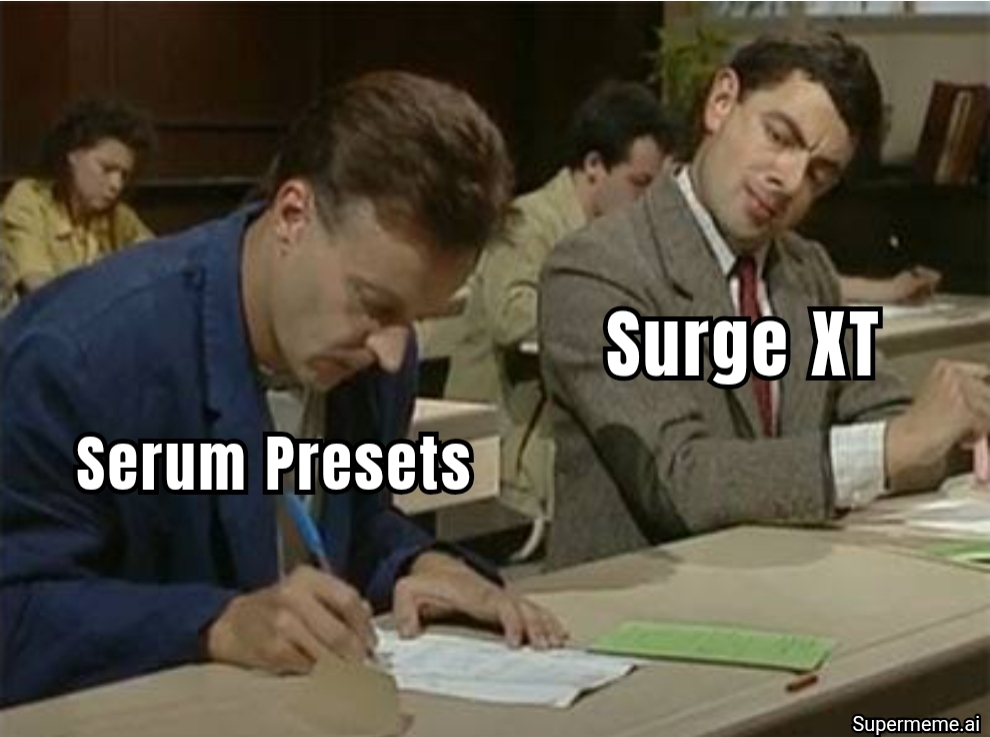

# Synth2Surge

> Part of the [Signals & Sorcery](https://signalsandsorcery.com) family of apps.

<p align="center">
  
</p>

Translate arbitrary VST synth patches (Serum, Vital, etc.) into sonically similar [Surge XT](https://surge-synthesizer.github.io/) patches — using black-box optimization that gets smarter over time through self-supervised machine learning.

Synth2Surge has two modes:

- **Use** — Give it an audio file, get back a Surge XT preset that sounds like it
- **Train** — Let it run unattended, generating its own training data and learning to make better predictions with each cycle

The system is a closed loop: it randomizes Surge XT parameters, renders audio, then learns to predict which parameters produced that audio. Over time, the ML model learns to warm-start the CMA-ES optimizer with increasingly accurate initial guesses, making optimization faster and more accurate.

## How It Works

### Without ML (classical optimization)

```
Target Audio (WAV)                 Surge XT
┌─────────────────────┐           ┌────────────────────────┐
│  User-provided or   │           │  ~500 active params    │
│  captured from a    │           │  (normalized 0-1)      │
│  source plugin      │           └──────────┬─────────────┘
└─────────┬───────────┘                      │
          │                        ┌─────────▼─────────────┐
          │                        │  CMA-ES Optimizer      │
          ├───────────────────────▶│  (Optuna)              │
          │                        │                        │
          │  compare audio         │  1. Suggest params     │
          │  (Enriched loss)       │  2. Render candidate   │
          │                        │  3. Compute loss       │
          │                        │  4. Repeat 100 trials  │
          │                        └─────────┬─────────────┘
          │                                  │
          │                        ┌─────────▼─────────────┐
          │                        │  Best Surge XT Patch   │
          │                        │  (.fxp preset file)    │
          │                        └───────────────────────┘
```

### With ML (self-improving)

```
┌─────────────────────────────────────────────────────────────────┐
│                  SELF-IMPROVING CLOSED LOOP                      │
│                                                                   │
│  TRAINING (runs unattended)          INFERENCE (user-facing)     │
│  ─────────────────────────           ────────────────────────    │
│                                                                   │
│  1. Randomize Surge params           1. User provides audio      │
│  2. Render audio (random MIDI)       2. Extract 7168-dim features│
│  3. Store (features, params)         3. ML predicts initial      │
│     as ground truth                     params (warm-start)      │
│  4. Train neural net on              4. CMA-ES refines from      │
│     accumulated data                    predicted starting point │
│  5. Repeat (thousands of times)      5. Output: Surge XT preset │
│                                                                   │
│  Each training cycle makes           No MIDI info needed —       │
│  inference predictions better        just audio in, preset out   │
└─────────────────────────────────────────────────────────────────┘
```

## Requirements

- **OS:** macOS (Apple Silicon recommended, Intel supported)
- **Python:** 3.11 or later
- **Surge XT:** Installed as VST3 at `/Library/Audio/Plug-Ins/VST3/Surge XT.vst3` (free from [surge-synthesizer.github.io](https://surge-synthesizer.github.io/))
- **PyTorch** *(optional)*: Required only for ML training and `--warm-start` inference. The classical CMA-ES optimizer works without it.
- **Source plugin** *(for capture only)*: Any VST3 or Audio Unit instrument (Serum, Vital, Diva, etc.)

## Installation

```bash
# 1. Install uv (if not already installed)
curl -LsSf https://astral.sh/uv/install.sh | sh

# 2. Clone and install
git clone https://github.com/shiehn/signals-to-surge.git
cd signals-to-surge
uv venv --python 3.12 .venv
source .venv/bin/activate
uv pip install -e ".[dev]"

# 3. (Optional) Install PyTorch for ML features
uv pip install torch

# 4. Verify
synth2surge --help
pytest tests/unit/
```

> **Note:** All CLI examples below assume you've activated the virtual environment (`source .venv/bin/activate`). If you haven't, prefix commands with `uv run`, e.g. `uv run synth2surge --help`.

## Quick Start

Here's a complete walkthrough you can run right now. Requires Surge XT installed.

### Download the pretrained model

A pretrained model (trained on 1,410 Surge XT patches with CLAP embeddings) is available as a [GitHub release](https://github.com/shiehn/Signals2Surge/releases). This is the fastest way to get started:

```bash
# Download the pretrained model (~3 MB)
synth2surge train download

# Capture audio from any synth
synth2surge capture --plugin "/Library/Audio/Plug-Ins/VST3/Surge XT.vst3" --no-gui

# Optimize with ML warm-start
synth2surge optimize --target ./workspace/target_audio.wav --warm-start
```

That's it — the pretrained model predicts initial parameters for all Surge XT scene A params, then CMA-ES refines from that starting point.

### Or: Train your own model

If you want to train from scratch or improve on the pretrained model:

### 1. Generate a small training dataset

```bash
# Generate 15 random patches (~30 seconds, produces ~5 non-silent patches)
synth2surge data generate --mode render-only --count 15 --seed 42

# Generate more with a different seed to accumulate data
synth2surge data generate --mode render-only --count 15 --seed 100 --no-resume
synth2surge data generate --mode render-only --count 15 --seed 200 --no-resume

# Check how much data we have
synth2surge data status
```

> **Note:** Only ~30% of fully randomized patches produce audible sound (the rest have volume/level params at zero). This is expected — the generator automatically skips silent patches. Run the command multiple times with different `--seed` values to accumulate data.

> **Note:** Use `--count 15` or less per invocation. Larger counts may cause pedalboard to crash due to VST3 plugin memory limits. Run the command multiple times to build up your dataset.

### 2. Train a model

```bash
# Train on accumulated data (need at least 10 patches)
synth2surge train run

# Check training status
synth2surge train status
```

### 3. Capture target audio and optimize

```bash
# Capture audio from Surge XT's default patch
synth2surge capture --plugin "/Library/Audio/Plug-Ins/VST3/Surge XT.vst3" --no-gui

# Quick optimization (stage 1 only, 50 trials)
synth2surge optimize \
  --target ./workspace/target_audio.wav \
  --stages 1 \
  --trials-t1 50

# With ML warm-start (if you've trained a model)
synth2surge optimize \
  --target ./workspace/target_audio.wav \
  --stages 1 \
  --trials-t1 50 \
  --warm-start
```

### 4. Inspect the result

```bash
ls workspace/best_patch.*
# workspace/best_patch.bin  workspace/best_patch.fxp  (load the .fxp in your DAW)
```

---

## Usage: Matching Sounds

This is the primary workflow — give Synth2Surge audio and get a Surge XT preset.

### Step 1: Capture a preset (if translating from another synth)

```bash
synth2surge capture \
  --plugin "/path/to/Serum.vst3" \
  --output-dir ./workspace
```

Opens the source plugin's GUI. Select a preset, close the window, and it captures:
- `workspace/target_audio.wav` — rendered audio
- `workspace/target_state.bin` — binary plugin state

| Flag | Default | Description |
|---|---|---|
| `--plugin` | *(required)* | Path to source VST3/AU plugin |
| `--output-dir` | `./workspace` | Output directory |
| `--no-gui` | `false` | Skip editor GUI, use default state |
| `--state-file` | *none* | Load `.fxp` or state file instead of GUI |
| `--probe-mode` | `single` | MIDI probe: `single`, `thorough` (6 probes), or `full` (14 probes) |
| `--duration` | `4.0` | Render duration in seconds |
| `--note` | `60` | MIDI note (60 = C4) |
| `--velocity` | `100` | MIDI velocity (0-127) |

### Step 2: Optimize

```bash
synth2surge optimize \
  --target ./workspace/target_audio.wav \
  --output-dir ./workspace
```

Produces:
- `workspace/best_patch.bin` — Surge XT plugin state
- `workspace/best_patch.fxp` — Surge XT preset file (load in any DAW)
- `workspace/best_audio.wav` — rendered audio of the best match

| Flag | Default | Description |
|---|---|---|
| `--target` | *(required)* | Path to target audio WAV file |
| `--output-dir` | `./workspace` | Output directory |
| `--surge-plugin` | `/Library/Audio/Plug-Ins/VST3/Surge XT.vst3` | Path to Surge XT |
| `--trials-t1` | `50` | Trials for tier 1 (structural: osc types, filters, ADSR, levels) |
| `--trials-t2` | `30` | Trials for tier 2 (shaping: osc params, LFOs, pitch, width) |
| `--trials-t3` | `20` | Trials for tier 3 (detail: FX, modulation depths) |
| `--stages` | `1,2,3` | Which stages to run (comma-separated) |
| `--probe-mode` | `single` | MIDI probe mode: `single`, `thorough`, `full` |
| `--warm-start` | `false` | Use ML model to predict initial params (requires PyTorch + trained model) |

**Quick test** (stage 1 only, fewer trials):

```bash
synth2surge optimize --target ./workspace/target_audio.wav --stages 1 --trials-t1 50
```

### Staged optimization explained

CMA-ES works well up to ~200 dimensions. Surge XT has ~500 active parameters (scene A + globals), so the optimizer runs in 3 stages, each tackling a different tier while freezing previous results:

| Stage | Tier | Parameters | What it controls |
|---|---|---|---|
| 1 | Structural | ~45 | Oscillator types, filter types/cutoff/resonance, ADSR envelopes, mixer levels, FM depth |
| 2 | Shaping | ~60 | Oscillator shape params, pitch/octave, LFO rates, filter balance, drift, feedback |
| 3 | Detail | ~175 | Everything else: FX, modulation depths, secondary settings |

---

## ML Training: Self-Improving Mode

The ML system is what makes Synth2Surge unique. It has a **closed training loop** — the system generates its own labeled training data without any human involvement.

### The core idea

1. **Randomize** all ~500 Surge XT parameters to uniform [0, 1]
2. **Render** audio through Surge XT with semi-random MIDI (random notes, velocities, durations)
3. **Extract** a 7168-dimensional audio feature vector (14 probes x 512-dim CLAP embeddings)
4. **Store** the pair `(audio_features, parameters)` — this IS the ground truth label, no human labeling needed
5. **Train** a neural network to predict parameters from audio features
6. **Use** the trained model to warm-start CMA-ES with a predicted initial guess
7. **Repeat** — better warm-starts lead to faster optimization, generating even more training data

At inference time, a user provides only an audio file. The model extracts audio features and predicts synth parameters. No MIDI information is needed — the model has learned the timbral characteristics of parameter combinations by hearing thousands of randomized patches.

### Step-by-step training

#### 1. Generate training data

```bash
# Generate 15 random patches per run (~30 seconds each)
# Only ~30% produce audible sound — this is expected
synth2surge data generate --mode render-only --count 15 --seed 42

# Run multiple times with different seeds to accumulate data
synth2surge data generate --mode render-only --count 15 --seed 100 --no-resume
synth2surge data generate --mode render-only --count 15 --seed 200 --no-resume
synth2surge data generate --mode render-only --count 15 --seed 300 --no-resume
```

> **Important:** Use `--count 15` or less per invocation. The VST3 plugin can crash with larger batch sizes due to memory limits. Use `--no-resume` with different `--seed` values for each run to ensure unique patches are generated.

| Flag | Default | Description |
|---|---|---|
| `--mode` | `render-only` | `render-only` (fast), `optimize` (rich), or `factory` (known presets) |
| `--count` | `100` | Number of patch attempts (use 15 or less) |
| `--surge-plugin` | `/Library/Audio/Plug-Ins/VST3/Surge XT.vst3` | Path to Surge XT |
| `--db-path` | `workspace/experience.db` | SQLite database path |
| `--trials` | `200` | CMA-ES trials per run (optimize mode only) |
| `--seed` | `42` | Random seed for reproducibility |
| `--no-resume` | *(flag)* | Force generation even if store already has data |

**Data generation modes compared:**

| Mode | Speed | What it stores | Best for |
|---|---|---|---|
| `render-only` | ~5 audible patches per 15 attempts | Ground truth `(features, params)` pairs | Bootstrapping: accumulate lots of data fast |
| `optimize` | ~5 min per patch | Ground truth + ~200 `(params, loss)` trial rows per run | Richer training signal with per-trial loss data |
| `factory` | ~2s per patch | Factory preset ground truth pairs | High-quality, musically meaningful data |

#### 2. Check data status

```bash
synth2surge data status
```

Shows total runs, trials, loss statistics, and how close you are to model readiness thresholds.

#### 3. Train the model

```bash
synth2surge train run
```

Trains a FeatureMLP predictor on all accumulated data. Saves a versioned checkpoint to `workspace/models/`. Requires at least 10 training examples.

| Flag | Default | Description |
|---|---|---|
| `--db-path` | `workspace/experience.db` | Experience store path |
| `--models-dir` | `workspace/models` | Checkpoint output directory |
| `--max-epochs` | `200` | Maximum training epochs |
| `--patience` | `20` | Early stopping patience |
| `--lr` | `0.001` | Learning rate |

#### 4. Check training status

```bash
synth2surge train status
```

Shows data counts, model versions, and whether you've hit the threshold for model training (50 runs).

#### 5. Use the trained model

```bash
synth2surge optimize --target audio.wav --warm-start
```

The `--warm-start` flag loads the latest trained model, predicts initial parameters, estimates confidence via MC Dropout, and either:
- **High confidence** (>0.6): Uses the prediction with tight CMA-ES search (sigma=0.15)
- **Medium confidence** (0.3-0.6): Uses the prediction with moderate search (sigma=0.3)
- **Low confidence** (<0.3): Falls back to default random CMA-ES initialization (sigma=0.4)

The system **never performs worse** than classical CMA-ES — low confidence triggers a graceful fallback.

### Autonomous training loop

For hands-off training, run the full cycle in one command:

```bash
synth2surge train loop \
  --cycles 10 \
  --patches-per-cycle 15 \
  --trials 200 \
  --feature-backend clap \
  --probe-mode full
```

Each cycle automatically:
1. Generates random patches (90% render-only, 10% with optimization)
2. Trains/retrains the predictor on all accumulated data
3. Reports metrics (loss, model version, data count)

| Flag | Default | Description |
|---|---|---|
| `--cycles` | `10` | Number of generate-then-train cycles |
| `--patches-per-cycle` | `100` | Patches to attempt per cycle (use 15 or less) |
| `--trials` | `200` | CMA-ES trials for the optimization fraction |
| `--seed` | `42` | Random seed |

### Data milestones

| Training examples | What unlocks |
|---|---|
| 10 | Minimum to attempt training (may not be useful yet) |
| 50 | Model starts providing useful warm-starts |
| 1,000+ | Model reliable enough to consider reducing CMA-ES trial budgets *(aspirational — not yet automated)* |
| 5,000+ | Model could potentially replace CMA-ES for familiar sound categories *(aspirational — not yet automated)* |

### Using a pretrained model

A pretrained model trained on 1,410 Surge XT patches is available at [v0.6.0](https://github.com/shiehn/Signals2Surge/releases/tag/v0.6.0):

```bash
# Download from the latest GitHub release
synth2surge train download

# Verify it's installed
synth2surge train status

# Use it
synth2surge optimize --target audio.wav --warm-start
```

The pretrained model is stored at `workspace/models/predictor_pretrained/`. When you run `--warm-start`, the system uses your own trained model if available, otherwise falls back to the pretrained model.

### Sharing a trained model

After training a model you're happy with, package it for others:

```bash
# Package your best model checkpoint as a zip
synth2surge train package \
  --checkpoint-dir workspace/models/predictor_v50

# This creates pretrained-model.zip (~1 MB)
# Upload it as a GitHub release asset named 'pretrained-model.zip'
```

**To create a GitHub release with the model:**

```bash
# Tag a release
git tag v0.6.0
git push origin v0.6.0

# Create the release and attach the model
gh release create v0.6.0 pretrained-model.zip \
  --title "v0.6.0 — Pretrained model" \
  --notes "Includes pretrained parameter predictor trained on N patches"
```

Other users can then install it with `synth2surge train download`.

### Full training runbook

This is the complete sequence of commands to train a production-quality model from scratch. Surge XT and PyTorch must be installed. Expect ~2-3 hours total on an M1/M3 Mac.

```bash
# ──────────────────────────────────────────────────────────────
# STEP 1: Generate training data (~2 hours)
# ──────────────────────────────────────────────────────────────
# Each invocation renders ~15 random Surge XT patches.
# ~30% produce audible sound, so 15 attempts ≈ 5 usable patches.
# We run many batches with different seeds to accumulate data.
# Target: 200+ patches for a useful model, 1000+ for a good one.

# Generate in batches of 15 (larger counts may crash the VST3 plugin)
for i in $(seq 1 200); do
  synth2surge data generate --mode render-only --count 15 --seed $i --no-resume
done

# Check progress at any time
synth2surge data status

# ──────────────────────────────────────────────────────────────
# STEP 2: Train the model (~30 seconds)
# ──────────────────────────────────────────────────────────────
synth2surge train run

# Check the result
synth2surge train status

# ──────────────────────────────────────────────────────────────
# STEP 3: Verify the model works
# ──────────────────────────────────────────────────────────────
# Capture target audio from Surge XT's default patch
synth2surge capture \
  --plugin "/Library/Audio/Plug-Ins/VST3/Surge XT.vst3" \
  --no-gui

# Optimize with warm-start and compare to cold
synth2surge optimize \
  --target ./workspace/target_audio.wav \
  --stages 1 \
  --trials-t1 50 \
  --warm-start

# ──────────────────────────────────────────────────────────────
# STEP 4: Package and share (optional)
# ──────────────────────────────────────────────────────────────
# Find the latest model version
synth2surge train status
# → shows "Latest model: vN"

# Package it
synth2surge train package \
  --checkpoint-dir workspace/models/predictor_vN

# Upload to GitHub releases
gh release create v0.6.0 pretrained-model.zip \
  --title "v0.6.0 — Pretrained model" \
  --notes "Trained on N patches, val_loss=X.XXX"
```

**Time estimates (M1/M3 Mac):**

| Step | Time | Notes |
|---|---|---|
| Generate 200 patches | ~20 min | 200 batches x ~6s each |
| Generate 1,000 patches | ~2 hours | 200 batches x 15 attempts each |
| Train model | ~30 seconds | On 1,000 patches, 200 epochs |
| Package model | < 1 second | Just zips model.pt + config.json |

**Tips:**
- You can interrupt and resume data generation — each run appends to the database
- Run `synth2surge data status` any time to check progress
- You can train intermediate models (`synth2surge train run`) while still generating data
- The training loop command (`synth2surge train loop`) automates steps 1-2 but is limited to 15 patches per cycle

### Storage estimates

| Scale | Database size |
|---|---|
| 1,000 render-only runs | ~5 MB |
| 1,000 runs with 200 trials each | ~1 GB |
| 10,000 render-only runs | ~50 MB |

---

## Other Commands

### Build the FAISS prior index

Pre-render Surge XT factory patch variations for nearest-neighbor warm-starting:

```bash
synth2surge build-prior --max-patches 100 --variations 5
```

### Inspect a patch

```bash
synth2surge inspect --patch "/Library/Application Support/Surge XT/patches_factory/Leads/Acidofil.fxp"
```

### REST API server

```bash
synth2surge serve --host 127.0.0.1 --port 8000
```

| Method | Path | Description |
|---|---|---|
| `GET` | `/health` | Health check |
| `POST` | `/capture` | Start a headless capture job |
| `POST` | `/optimize` | Start an optimization job |
| `GET` | `/jobs/{job_id}` | Poll job status and progress |
| `POST` | `/jobs/{job_id}/cancel` | Cancel a running job |
| `GET` | `/prior/status` | Check FAISS prior index status |

---

## Troubleshooting

### "Segmentation fault" during data generation

The VST3 plugin can crash after processing many patches in a single process. Use `--count 15` or less per invocation and run the command multiple times with different `--seed` values.

### "Generated 0 patches"

Most fully randomized Surge XT parameter configurations produce silence (volume at 0, oscillators muted, etc.). This is normal. Run the command a few times with different seeds — typically ~30% of attempts produce audible patches.

### "Not enough training data"

You need at least 10 non-silent patches before training will start. Run `synth2surge data status` to check your current count, then generate more data.

### PyTorch not installed

The `--warm-start` flag and `synth2surge train` commands require PyTorch. Install it with:

```bash
uv pip install torch
```

The core optimization (`synth2surge optimize` without `--warm-start`) works without PyTorch.

---

## Architecture

### System overview

Synth2Surge is a pure Python application built on [Spotify's pedalboard](https://github.com/spotify/pedalboard) for VST3/AU plugin hosting. The ML subsystem is optional — the classical CMA-ES optimizer works standalone.

```
┌─────────────────────────────────────────────────────────────────┐
│                         SYNTH2SURGE                              │
│                                                                   │
│  ┌───────────┐   ┌────────────────┐   ┌──────────────────────┐  │
│  │  CLI      │   │  REST API      │   │  ML Training Loop    │  │
│  │  (typer)  │   │  (FastAPI)     │   │  (autonomous)        │  │
│  └─────┬─────┘   └───────┬────────┘   └──────────┬───────────┘  │
│        │                  │                       │               │
│  ┌─────▼──────────────────▼───────────────────────▼───────────┐  │
│  │                    CORE PIPELINE                             │  │
│  │                                                              │  │
│  │  Capture ──▶ Optimize ──▶ Export                             │  │
│  │              ▲      │                                        │  │
│  │              │      ▼                                        │  │
│  │        ┌─────┴──────────┐    ┌──────────────────────┐       │  │
│  │        │  Loss Function │    │  ML Subsystem         │       │  │
│  │        │  (Enriched     │    │  (PyTorch, optional)  │       │  │
│  │        │   MR-STFT)     │    │                       │       │  │
│  │        └────────────────┘    │  Experience Store     │       │  │
│  │                              │  Predictor (MLP)      │       │  │
│  │  ┌──────────────────────┐    │  Warm Starter         │       │  │
│  │  │  Plugin Host         │    │                       │       │  │
│  │  │  (pedalboard)        │    │                       │       │  │
│  │  │  Surge XT raw_value  │    └──────────────────────┘       │  │
│  │  └──────────────────────┘                                    │  │
│  └──────────────────────────────────────────────────────────────┘  │
└─────────────────────────────────────────────────────────────────┘
```

### Module map

```
src/synth2surge/
├── audio/                  # Plugin hosting & rendering
│   ├── engine.py           #   PluginHost: pedalboard wrapper (load, render, state, raw_value API)
│   ├── midi.py             #   MIDI probe generation (single/thorough/full multi-probe system)
│   ├── renderer.py         #   High-level render pipeline
│   └── standard_probes.py  #   Multi-probe constants: 14 probes x 512 = 7168-dim (full mode)
│
├── loss/                   # Audio comparison (objective functions)
│   ├── mr_stft.py          #   Multi-Resolution STFT loss (spectral convergence + log-magnitude)
│   ├── enriched.py         #   Enriched loss: MR-STFT + MFCC + envelope + centroid + flux
│   └── features.py         #   512-dim feature vectors (CLAP or mel-stats backend)
│
├── ml/                     # Machine learning subsystem (optional, requires PyTorch)
│   ├── experience_store.py #   SQLite store for optimization runs and trials
│   ├── data_generator.py   #   Autonomous self-play data generation (render-only / optimize / factory)
│   ├── predictor.py        #   FeatureMLP model (audio features → synth params)
│   ├── trainer.py          #   Training loop: tier-weighted MSE, AdamW, cosine annealing, early stopping
│   ├── warm_start.py       #   CMA-ES warm-start from ML predictions with MC Dropout confidence
│   ├── training_loop.py    #   Autonomous generate → train → evaluate loop
│   └── pretrained.py       #   Pretrained model download and management
│
├── surge/                  # Surge XT patch management
│   ├── patch.py            #   XML/FXP parser, writer, mutator
│   ├── fxp_export.py       #   FXP header construction (CcnK format)
│   ├── preset_loader.py    #   Auto-discover parameter mapping, load FXP → plugin
│   ├── parameter_space.py  #   Parameter definitions, bounds, 3-tier classification
│   └── factory.py          #   Factory patch discovery
│
├── prior/                  # FAISS nearest-neighbor index
│   ├── generator.py        #   Gaussian patch variation generator
│   └── index.py            #   FAISS IndexFlatIP (brute-force cosine similarity)
│
├── optimizer/              # CMA-ES optimization
│   ├── loop.py             #   Multi-stage loop: 3-tier CMA-ES with parameter freezing
│   └── strategies.py       #   Optimization strategies
│
├── capture/                # Source plugin capture
│   └── workflow.py         #   GUI and headless capture workflows
│
├── api/                    # REST API
│   ├── app.py              #   FastAPI application factory
│   ├── routes.py           #   Endpoints with background job management
│   └── schemas.py          #   Pydantic request/response models
│
├── cli/                    # Command-line interface
│   └── main.py             #   Typer CLI: capture, optimize, data, train, build-prior, inspect, serve
│
├── config.py               #   All configuration: audio, MIDI, loss, ML, enriched loss
└── types.py                #   Shared dataclasses: CaptureResult, OptimizationResult, MLPrediction
```

### Key design decisions

#### Plugin hosting via pedalboard's `raw_value` API

Surge XT exposes ~500 active parameters (scene A + globals) through pedalboard, each with a `raw_value` property normalized to [0, 1]. The optimizer works directly with these raw values, bypassing XML patch manipulation during the optimization loop. The plugin handles internal domain mapping (cutoff in Hz, time in log-seconds, etc.) transparently.

#### Enriched MR-STFT loss

The base loss (MR-STFT) computes spectral convergence and log-magnitude distance at 3 FFT resolutions (2048, 1024, 512). The enriched version adds four complementary metrics that fill perceptual gaps:

| Component | Weight | What it captures | MR-STFT gap it fills |
|---|---|---|---|
| MR-STFT | 0.60 | Spectral magnitude distribution | *(baseline)* |
| MFCC distance | 0.15 | Timbral shape (vocal-tract-like filtering) | Coarse spectral shape |
| Envelope correlation | 0.10 | Amplitude contour (attack, sustain, release) | Temporal dynamics |
| Spectral centroid | 0.10 | Brightness evolution over time | Time-varying character |
| Spectral flux | 0.05 | Rate of spectral change (transients, modulation) | Temporal texture |

All components use librosa (already a dependency). Total overhead: ~5ms per evaluation.

> **Note:** As of v0.6.0, enriched loss is the **default** used by the CMA-ES optimizer (not just defined — actively used in all optimization runs).

#### Staged CMA-ES optimization

CMA-ES works well up to ~200 dimensions. With ~500 active parameters (scene A + globals), the 3-tier staged approach optimizes the most impactful parameters first, then freezes those values and refines secondary parameters, then detail parameters. Each stage runs an independent CMA-ES sampler.

#### ML parameter predictor

**FeatureMLP** (~5.5M parameters):
```
Input: 7168-dim CLAP embeddings (14 probes x 512)
  → Linear(7168, 2048) + LayerNorm + GELU + Dropout(0.1)
  → Linear(2048, 1024) + LayerNorm + GELU + Dropout(0.1)
  → Linear(1024, 512) + LayerNorm + GELU + Dropout(0.1)
  → Linear(512, N_params) + Sigmoid
Output: [0,1] parameter predictions for all Surge XT scene A params
```

Training uses **tier-weighted MSE loss** (tier 1: 3x, tier 2: 1.5x, tier 3: 1x) because getting oscillator type and filter cutoff right matters far more than modulation depth.

#### Warm-start confidence via MC Dropout

At inference, the model runs 10 forward passes with dropout enabled. The variance across predictions gives per-parameter uncertainty. Overall confidence = `1 - mean(std)`. This determines how tightly to initialize CMA-ES around the prediction:

| Confidence | Action | CMA-ES sigma |
|---|---|---|
| > 0.6 | Use prediction, tight search | 0.15 |
| 0.3 - 0.6 | Use prediction, moderate search | 0.30 |
| < 0.3 | **Fall back to default** (no warm-start) | 0.40 |

#### Experience store (SQLite)

All optimization runs and trials are logged to a SQLite database with numpy array BLOBs. Schema:

- **`runs`** table: run_id, target_features (7168-dim), best_params, ground_truth_params, best_loss, generation_mode, model_version, schema_version, feature_backend, target_audio
- **`trials`** table: run_id, stage, trial_idx, params, loss
- **`model_versions`** table: version_id, training metrics, checkpoint path

This is the foundation everything else builds on — every optimization run generates free training data.

### Dependencies

| Package | Purpose |
|---|---|
| `pedalboard` | VST3/AU plugin hosting, MIDI rendering, parameter access |
| `librosa` | STFT computation, mel spectrograms, MFCC, spectral features |
| `numpy` | Numerical operations |
| `soundfile` | WAV file I/O |
| `optuna` + `cmaes` | CMA-ES optimization framework |
| `faiss-cpu` | Nearest-neighbor similarity search |
| `lxml` | Surge XT XML patch parsing |
| `fastapi` + `uvicorn` | REST API server |
| `typer` + `rich` | CLI framework with progress bars |
| `pydantic` + `pydantic-settings` | Configuration and API schema validation |
| `mido` | MIDI message handling |
| `torch` *(optional)* | Neural networks for parameter prediction |
| `laion-clap` / `transformers` | CLAP audio embeddings |
| `auraloss` | Differentiable STFT loss |

---

## Testing

250 tests across unit, integration, and end-to-end levels.

```bash
# All unit tests (no plugins required, ~3 seconds)
pytest tests/unit/

# ML e2e tests (requires PyTorch, no plugins required, ~10 seconds)
pytest tests/e2e/test_ml_training_loop.py

# Real Surge XT e2e tests (requires Surge XT + PyTorch, ~2 minutes)
pytest tests/e2e/test_ml_surge_rendering.py

# All tests (requires Surge XT for integration/e2e)
pytest

# With coverage
pytest --cov=synth2surge --cov-report=term-missing

# Lint
ruff check src/ tests/
```

Tests that require Surge XT are marked `@pytest.mark.requires_surge` and auto-skip if it's not installed. ML tests auto-skip if PyTorch is not installed.

| Level | What it validates |
|---|---|
| **Unit** (180) | Loss math, XML parsing, parameter normalization, MIDI generation, FAISS indexing, CLI args, API routes, experience store, ML models, training, warm-start |
| **E2E synthetic** (15) | Full ML pipeline with synthetic audio: generate → train → predict → evaluate. Model predictions 30% better than random. |
| **E2E Surge XT** (17) | Real plugin rendering, data generation, optimization, factory round-trips, multi-probe pipeline, and closed-loop: generate → train → warm-start predict with actual Surge XT audio |
| **Integration** | Plugin loading, audio rendering, state round-trip, optimizer convergence |
| **Acceptance** | Loss ranking correctness, feature similarity, self-translation quality |

## Future Improvements

The v0.6.0 architecture (CLAP embeddings + 14-probe + enriched loss + scaled MLP) establishes a strong baseline. The model plateaus at ~0.0435 val_loss with ~1,400 samples. The following improvements are ranked by expected impact.

### Audio-domain round-trip loss (Phase 5)

The current training loss (parameter MSE) is fundamentally flawed for Surge XT. An [ISMIR 2025 paper on Surge XT parameter symmetries](https://arxiv.org/abs/2506.07199) proved that multiple parameter configurations produce identical sounds (e.g., swapping oscillators 1 and 2). Parameter MSE penalizes these equivalent solutions.

The fix: instead of comparing predicted vs ground-truth *parameters*, render audio from the predicted parameters and compare the *audio*. The experience store already saves rendered audio (target_audio column) for this purpose. The approach:

1. After initial training, predict params for each training sample
2. Render audio from predicted params in Surge XT (subprocess)
3. Compute enriched audio loss between predicted-audio and target-audio
4. Upweight samples where audio loss >> param MSE (model learned wrong-sounding params)
5. Downweight samples where param MSE is high but audio loss is low (harmless symmetry)

This addresses the root cause of the loss plateau without requiring a differentiable synthesizer.

### Differentiable synthesizer proxy

Train a neural network to approximate Surge XT's rendering behavior (params → spectrogram). This would enable true end-to-end gradient-based training through the audio domain using [auraloss](https://github.com/csteinmetz1/auraloss) multi-resolution STFT loss, replacing CMA-ES for parameter refinement entirely. Related work: [InverSynth II (ISMIR 2023)](https://archives.ismir.net/ismir2023/paper/000076.pdf), [DiffMoog (2024)](https://arxiv.org/abs/2401.12570).

### Audio Spectrogram Transformer

Replace the FeatureMLP with an Audio Spectrogram Transformer (AST) that operates directly on mel spectrograms rather than pre-extracted CLAP embeddings. A [DAFx 2024 paper](https://arxiv.org/html/2407.16643v1) showed AST massively outperforms MLP baselines for synth parameter prediction when trained on 1M+ random presets. This would require significantly more training data but could break through the current accuracy ceiling.

### Hybrid feature embeddings

The ["Diverse Audio Embeddings" paper (2023)](https://arxiv.org/abs/2309.08751) showed that combining handcrafted features with pretrained embeddings outperforms either alone. The current pipeline uses CLAP only; concatenating the original mel-stat features alongside CLAP embeddings (1024-dim per probe instead of 512) could capture complementary information.

### Factory preset training data

The current training data is entirely random parameter combinations. Adding Surge XT's ~500 factory presets as training data would provide musically meaningful ground truth — real patches designed by sound designers rather than random noise. The `generate_from_factory` data generator already supports this.

### Stabilizing Surge XT rendering

Currently ~25-30% of rendering attempts crash (SIGSEGV) due to unstable parameter combinations in Surge XT. Expanding the crash-pattern filter (`_CRASH_PATTERNS` in data_generator.py) through systematic binary search would increase data yield per cycle and training throughput.

### Research references

- **"Instrumental" (2025)** — CMA-ES + composite loss is SOTA for black-box synth matching
- **ISMIR 2025 "Symmetric Parameter Spaces"** — Surge XT has parameter permutation symmetries; parameter MSE is fundamentally limited
- **"Diverse Audio Embeddings" (2023)** — Hybrid handcrafted + pretrained features outperform either alone
- **LAION-CLAP** — Best alignment with human-perceived timbre similarity
- **Synplant 2 (Sonic Charge)** — Validates the ML warm-start + evolutionary refinement architecture used by Synth2Surge

---

## License

GPLv3 -- see [LICENSE](LICENSE).
